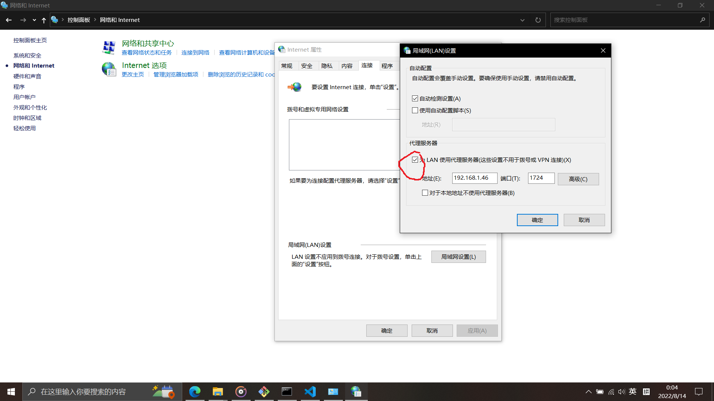

## 开启代理服务器

>reg add "HKCU\Software\Microsoft\Windows\CurrentVersion\Internet Settings" /v ProxyEnable /t REG_DWORD /d 1 /f

指令等同于把这个勾打上

## 关闭代理服务器

>reg add "HKCU\Software\Microsoft\Windows\CurrentVersion\Internet Settings" /v ProxyEnable /t REG_DWORD /d 0 /f

相当于把那个勾取消

## 设置代理服务器的地址与端口

>reg add "HKCU\Software\Microsoft\Windows\CurrentVersion\Internet Settings" /v ProxyServer /d "192.168.1.46:1724" /f

相当于修改那个勾下面的框里面的地址为192.168.1.46端口为1724

>reg add "HKCU\Software\Microsoft\Windows\CurrentVersion\Internet Settings" /v ProxyServer /d "" /f

相当于把那个勾下面的框里面的地址和端口清空