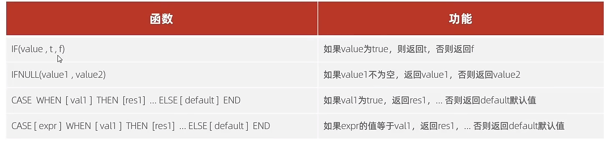

# 流程控制函数

## 常用函数

## 使用实例

年龄大于14 列为jk,年龄 小于14 大于等于 8 列为 loli 小于 8 列为 js,大于17 列为老阿姨

select case when age>=17 then 'old women' when age>=14 then 'JK' when age>=8 then 'loli' else 'js' end as 'type' from artist;
