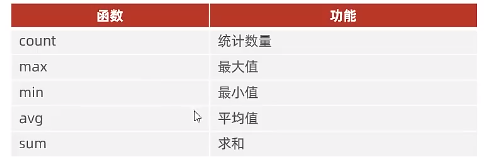

# DQL聚合函数

## 常见聚合函数

## 语法

select [聚合函数](字段列表) from 表名

## 消去重复

avg count 支持distinct关键字

用法:
>select [聚合函数](distinct [col name]);
示例:
计算用户数量
select count(distinct userId) from user;

## 例子

1.计算字段数量
>select count(*) from tableName;

2.计算平均值
>select avg(age) from artist;

