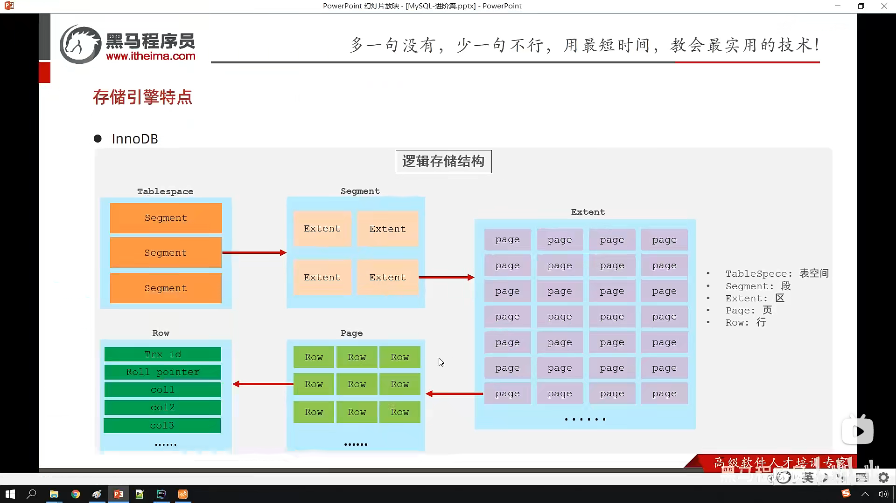

# 各个存储引擎特点

## innodb

### 介绍

innodb 是一种兼顾高可靠性和高性能的通用存储引擎，在mysql5.5之后,是mysql的默认存储引擎

### 特点

dml 操作遵循ACID模型，支持事务
行级锁，提高并发访问性能
支持外键约束，保证数据的完整性和正确性

### 文件

xxx.ibd:xxx代表的是表名，innodb引擎的每张表都会对应这样一个表空间文件，存储该表的结构(frm,sdi),数据和索引
参数:innodb_file_per_table

### 逻辑存储结构

## MyISAM

### 介绍

不支持事务，不支持外键
支持表锁，不支持行锁
访问速度快

### 文件

sdi,myd,myi

## Memory

### 介绍

数据存储在内存当中

### 特点

内存

支持hash索引

### 文件

xxx.sdi：存储表结构信息

